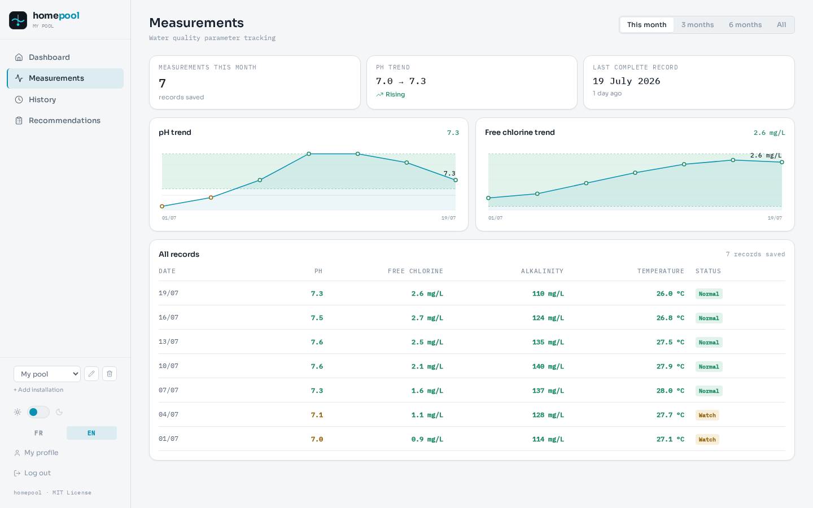
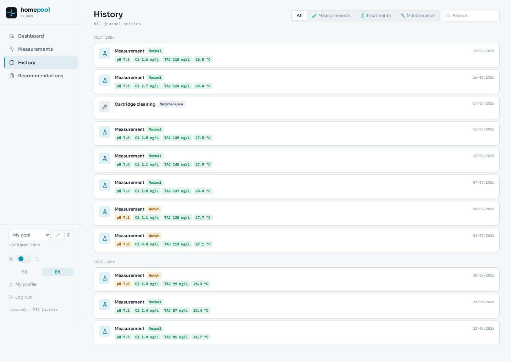
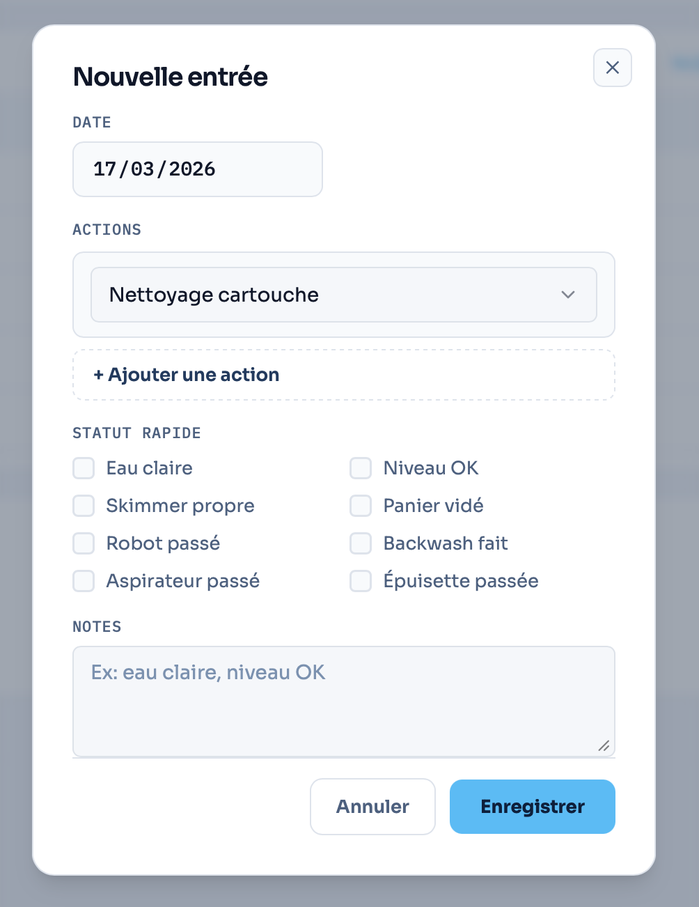

<div align="center">


**Pool & spa maintenance tracker — self-hosted, built for the Home Assistant crowd**

*(the app itself supports English and French via an in-app language toggle — this documentation is English-only)*

[](https://github.com/alecc08/homepool/releases)
[](LICENSE)
[](docker-compose.yml)
[](https://fastapi.tiangolo.com)
[](https://react.dev)

### ☕ Support

If homepool is useful to you, consider buying me a coffee:

[](https://ko-fi.com/T6T61NJXQS)

</div>

---

## 🙏 Credits

homepool started life as a fork of [Pooly](https://github.com/aurel-f/pooly), created by
[aurel-f](https://github.com/aurel-f) — the original app, its data model, and the core
idea of a clean, self-hosted pool/spa tracker all trace back to that project. homepool has
since grown into its own thing (new name, Home Assistant integration, salt-pool support,
configurable ranges, and more), so it's no longer maintained as a fork, but credit for the
original idea belongs there. If you like this project, go star the
[original repository](https://github.com/aurel-f/pooly) too.

---

## Table of contents
- [Overview](#-overview)
- [Features](#-features)
- [Screenshots](#-screenshots)
- [Quick start](#-quick-start)
- [Configuration](#-configuration)
- [Home Assistant Integration](#-home-assistant-integration)
- [Tech stack](#-tech-stack)
- [Contributing](#-contributing)
- [Support](#-support)
- [License](#-license)

---

### 🌊 Overview

homepool is a **self-hosted** web application to track the maintenance of your pools and spas. Log your water measurements, treatments and maintenance tasks from a clean dashboard — your data stays on your own server.

Designed for self-hosters and the Home Assistant crowd who want full control without complexity: one Docker command and you're up and running, with a first-class HA integration to bring your water parameters into your existing smart-home setup.

---

### ✨ Features

- **Full dashboard** — KPIs, real-time water parameters, visual water quality indicator
- **Home Assistant integration** — sensors for water parameters and maintenance-due tracking, installable via HACS
- **AquaChek test strip input** — interactive color chart for pH, Alkalinity, Bromine, Chlorine and Hardness
- **Digital device input** — decimal inputs with range validation
- **Multi-installation** — manage multiple pools and spas with adapted reference ranges
- **Bromine, chlorine or salt** — differentiated ideal ranges per sanitizer, including salt water generator (SWG) pools, with free-chlorine targets set for the higher CYA a salt system runs at
- **Configurable ideal ranges** — override any water-parameter range per installation, right from the UI
- **Full history** — monthly timeline, type filters, full-text search
- **Measurements page** — track parameter trends over time
- **Dark mode** — light, dark or automatic theme (system preference)
- **PWA** — installable on mobile, bottom navigation, bottom sheet modal
- **Self-hosted & private** — no third-party cloud, no tracking, your data stays yours

---

### 📸 Screenshots

<div align="center">

| Dashboard — Light mode | Dashboard — Dark mode |
|---|---|
|  |  |

| Measurements | History |
|---|---|
|  |  |

| New entry — Maintenance | New entry — AquaChek strip |
|---|---|
|  |  |

</div>

---

### 🚀 Quick start

**Requirements**: Docker and Docker Compose installed on your machine.

```bash
# 1. Clone the repository
git clone https://github.com/alecc08/homepool.git
cd homepool

# 2. Set up environment
cp .env.example .env
nano .env  # Set your passwords and secrets

# 3. Start homepool
docker compose up -d

# 4. Open in your browser
open http://localhost:8090
```

The app is available at `http://localhost:8090`. Create your account on first login.

---

### ⚙️ Configuration

Copy `.env.example` to `.env` and adjust the values:

| Variable | Description | Default |
|---|---|---|
| `POSTGRES_PASSWORD` | PostgreSQL password | — |
| `SESSION_SECRET` | Session secret key | — |
| `APP_BASE_URL` | Public app URL | `http://localhost:8090` |
| `ALLOWED_ORIGINS` | Allowed CORS origins | `http://localhost:8090` |
| `DEBUG` | Debug mode (logs reset links) | `false` |

> ⚠️ **Never commit your `.env` file**. It is already in `.gitignore`.

#### Customizing ideal water-parameter ranges

Every ideal/acceptable range shown in the app (pH, free chlorine, salt, CYA, alkalinity, hardness, temperature...) has sensible built-in defaults per installation type and sanitizer — including a salt water generator (SWG) profile with a higher CYA target (60-80 ppm) and a matching free-chlorine band, following [PoolMath](https://www.troublefreepool.com/blog/poolmath/) / Trouble Free Pool guidance. If your setup runs differently, open an installation's edit modal → **Water Chemistry Targets** tab to customize any band per installation, right from the UI — no env vars or restarts required.

> ⚠️ **Upgrading from an older version?** The `RANGE_<TYPE>_<SANITIZER>_<PARAM>_{IDEAL,ACCEPTABLE}_{MIN,MAX}` env var mechanism has been removed in favor of the per-installation UI above. If you were relying on `RANGE_*` env vars, re-apply your preferred ranges per-installation via the UI after upgrading — the env vars are now ignored.

---

### 🏠 Home Assistant Integration

homepool's water measurements can be pulled into Home Assistant as sensors.

1. **Install via HACS**
   Settings → HACS → custom repositories (⋮ menu) → add repository URL `https://github.com/alecc08/homepool`, category **Integration** → find "homepool" in HACS → Install.

2. **Add the integration**
   Settings → Devices & Services → Add Integration → search for "homepool".

3. **Configure**
   - **Base URL**: your homepool server URL. If you're running behind the bundled nginx/reverse-proxy setup, this **must include the `/api` path** — e.g. `https://your-domain/api`, not just `https://your-domain`. Using the domain without `/api` will result in a "failed to connect to the homepool server" error.
   - **API Key**: generate one from Settings → API Key in the homepool web app.

4. **Result**
   Once added, you'll get a Sensors card with your installation's water parameters, plus two "days until due" sensors per installation — **Days Until pH Measurement Due** and **Days Until Filter Maintenance Due**. These are plain numeric sensors (not on/off) that go negative once overdue, so you can set your own automation threshold instead of a fixed one, e.g. trigger a notification when `states('sensor.xxx_days_until_ph_measurement_due') | int <= 3`:

   

5. **Display on a dashboard (optional)**
   homepool's integration only exposes the raw sensor entities — for a nicer pool-specific dashboard widget, pair it with the [Pool Monitor Card](https://github.com/wilsto/pool-monitor-card) (installable via HACS as a frontend repository). Use the homepool sensors as the card's data source to get a purpose-built pool/spa display.

6. **Quick-add maintenance from Home Assistant**
   Each installation also gets one button entity per maintenance type — **Log Cartridge Cleaning**, **Log Skimmer Filter Cleaning**, **Log Backwash**, **Log pH Calibration**, **Log Purge**, **Log Water Change**. Pressing one logs that maintenance action against homepool immediately, no app needed.

   For measurements (pH, chlorine, etc.), which need numeric input a plain button can't collect, use the `homepool.log_measurement` service instead — call it from a script, automation, or a dashboard button's `tap_action: perform-action`.

   Example Lovelace card combining both:

   ```yaml
   type: grid
   columns: 2
   square: false
   cards:
     - type: button
       tap_action:
         action: call-service
         service: button.press
         target:
           entity_id: button.pool_log_cartridge_cleaning
       name: Cartridge cleaning
       icon: mdi:air-filter
     - type: button
       tap_action:
         action: call-service
         service: button.press
         target:
           entity_id: button.pool_log_backwash
       name: Backwash
       icon: mdi:valve
     - type: button
       tap_action:
         action: perform-action
         perform_action: homepool.log_measurement
         target: {}
         data:
           installation_id: 1
           ph: 7.2
           chlorine: 1.5
       name: Log measurement
       icon: mdi:flask-outline
   ```

---

### 🛠 Tech stack

| Layer | Technology |
|---|---|
| Frontend | React 19, Vite, Tailwind CSS |
| Backend | FastAPI, SQLModel, Python 3.12 |
| Database | PostgreSQL 16 |
| Auth | Cookie sessions (httpOnly, same_site=strict) |
| Deployment | Docker Compose |
| Typography | Sora + IBM Plex Mono |

---

### 🤝 Contributing

Contributions are welcome! Here's how to get involved:

```bash
# Fork the repo, then:
git clone https://github.com/alecc08/homepool.git
cd homepool
git checkout -b feature/my-feature

# Make your changes, then:
git commit -m "feat: describe the feature"
git push origin feature/my-feature
# Open a Pull Request
```

**Appreciated contribution types:**
- 🐛 Bug fixes
- ✨ New features
- 🌍 Translations
- 📸 Screenshots and demos
- 📖 Documentation improvements

Check the [open issues](https://github.com/alecc08/homepool/issues) to find something to work on.

---

### 📄 License

Distributed under the **MIT License**. See [LICENSE](LICENSE) for more information.

---

<div align="center">
  <sub>Made with ♥ · Self-hosted · Open source</sub>
</div>
