[](https://ko-fi.com/T6T61NJXQS)

homepool started life as a fork of [Pooly](https://github.com/aurel-f/pooly), created by
[aurel-f](https://github.com/aurel-f) — the original app, its data model, and the core
idea of a clean, self-hosted pool/spa tracker all trace back to that project. homepool has
since grown into its own thing (new name, Home Assistant integration, salt-pool support,
configurable ranges, and more), so it's no longer maintained as a fork, but credit for the
original idea belongs there. If you like this project, go star the
[original repository](https://github.com/aurel-f/pooly) too.

---

<div align="center">

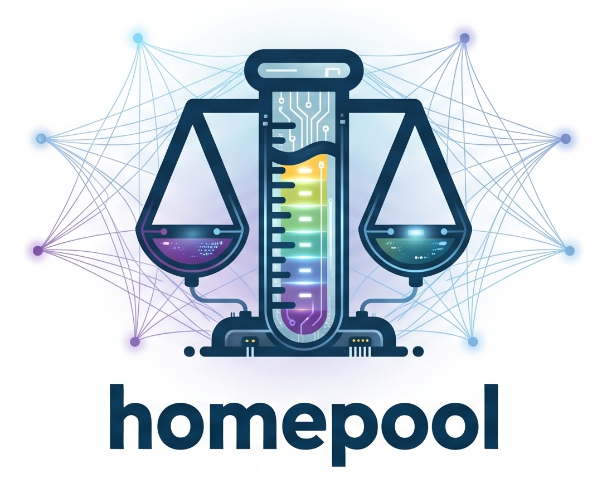

**Pool & spa maintenance tracker — self-hosted, built for the Home Assistant crowd**

*(the app itself supports English and French via an in-app language toggle — this documentation is English-only)*

[](https://github.com/alecc08/homepool/releases)
[](LICENSE)
[](compose.yaml)
[](https://fastapi.tiangolo.com)
[](https://react.dev)
[](https://github.com/alecc08/homepool/actions/workflows/hacs.yml)

</div>

---

### 🌊 Overview

homepool is a **self-hosted** web application to track the maintenance of your pools and spas. Log your water measurements, treatments and maintenance tasks from a clean dashboard — your data stays on your own server.

Designed for self-hosters and the Home Assistant crowd who want full control without complexity: one Docker command and you're up and running, with a first-class HA integration — including a purpose-built Lovelace card — to bring your water parameters into your existing smart-home setup.

**Features:**

- **Water status board** — mono-value param tiles with status dot, ideal range, and per-parameter trend sparkline
- **Home Assistant integration** — sensors, maintenance-logging buttons, and a custom Lovelace card, installable via HACS
- **AquaChek test strip input** — interactive color chart for pH, Alkalinity, Bromine, Chlorine and Hardness
- **Digital device input** — decimal inputs with range validation
- **Multi-installation** — manage multiple pools and spas with adapted reference ranges
- **Bromine, chlorine or salt** — differentiated ideal ranges per sanitizer, including a full salt water generator (SWG) profile: higher CYA, a matching free-chlorine target, and a lower total alkalinity target to slow the pH rise SWG cells cause
- **Configurable ideal ranges** — override any water-parameter range per installation, right from the UI
- **Dosage recommendations** — out-of-range params get a targeted dosing suggestion (liquid CYA now gets a real active-ingredient estimate instead of just "check the bottle"), plus a what-if simulator with slider inputs bounded by your installation's own acceptable ranges and prefilled from your latest reading
- **Full history** — monthly timeline, type filters, full-text search
- **Dark mode** — light, dark or automatic theme (system preference)
- **PWA** — installable on mobile, bottom navigation, bottom sheet modal
- **Self-hosted & private** — no third-party cloud, no tracking, your data stays yours

---

### 📸 Screenshots

<div align="center">

| Dashboard — Dark mode | Dashboard — Light mode |
|---|---|
| 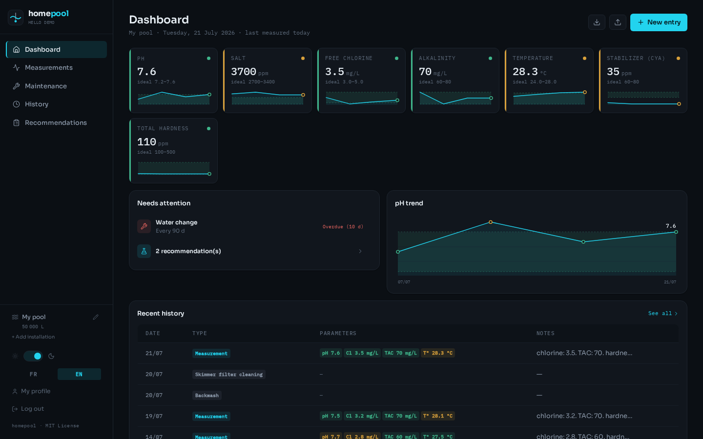 | 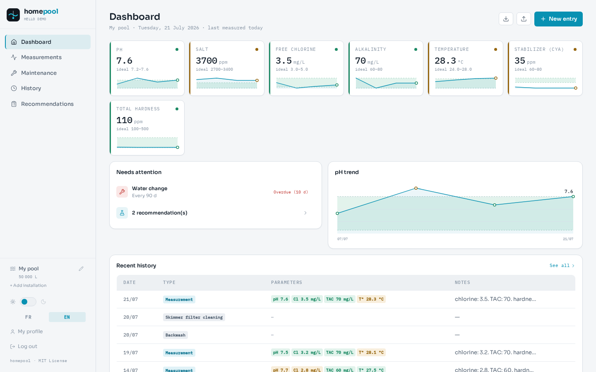 |

| Measurements | Maintenance |
|---|---|
| 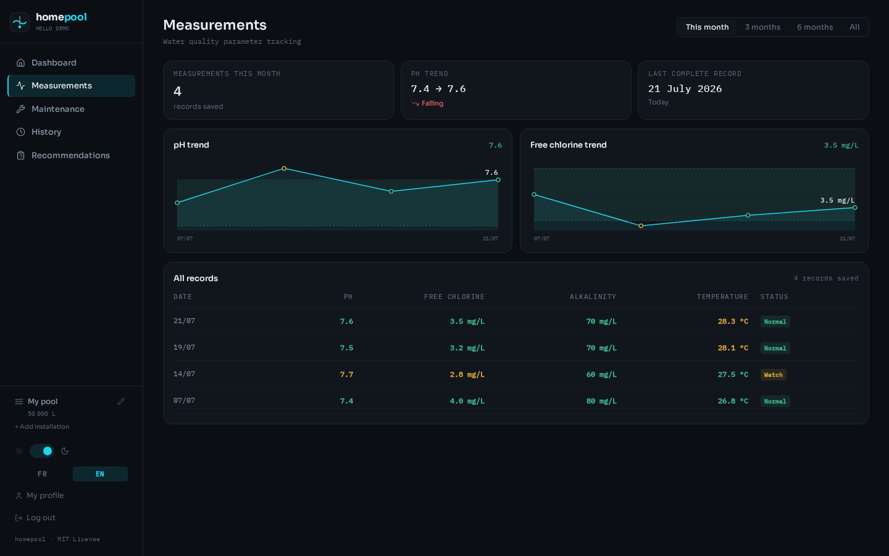 | 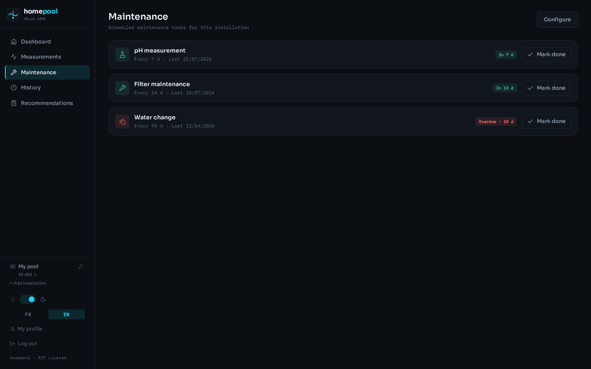 |

| History | Recommendations |
|---|---|
| 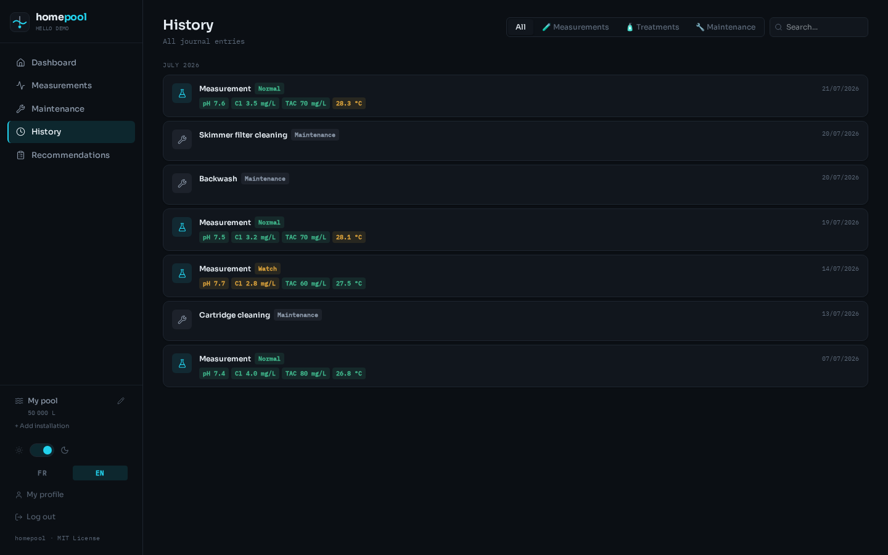 | 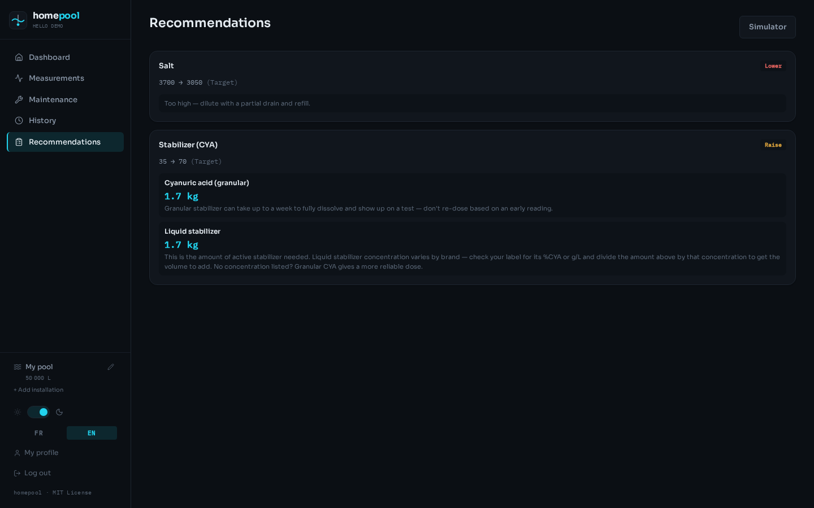 |

| New entry — AquaChek strip |
|---|
| 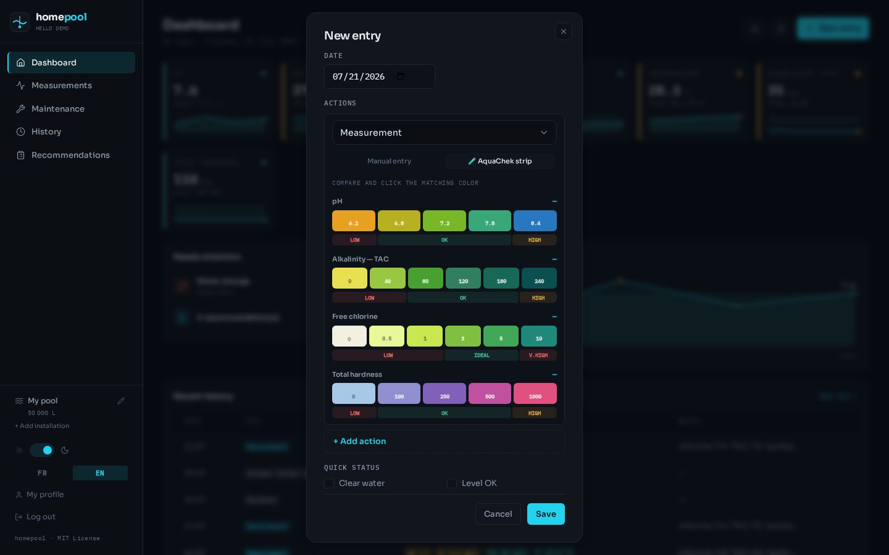 |

</div>

---

### 🚀 Quick start

**Requirements**: Docker and Docker Compose installed on your machine.

```bash
# 1. Clone the repository
git clone https://github.com/alecc08/homepool.git
cd homepool

# 2. Set up environment
cp .env.example .env
nano .env  # Set your passwords and secrets

# 3. Start homepool
docker compose up -d

# 4. Open in your browser
open http://localhost:8090
```

The app is available at `http://localhost:8090`. Create your account on first login.

---

### 🏠 Home Assistant Integration

homepool ships a full Home Assistant integration: sensors for every water parameter, maintenance-due tracking, one-tap maintenance buttons, and a custom **homepool card** for your dashboard.

[](https://my.home-assistant.io/redirect/config_flow_start/?domain=homepool)

#### 1. Install via HACS

Settings → HACS → custom repositories (⋮ menu) → add repository URL `https://github.com/alecc08/homepool`, category **Integration** → find "homepool" in HACS → Install.

#### 2. Add the integration

Settings → Devices & Services → Add Integration → search for "homepool".

#### 3. Configure

- **Base URL**: your homepool server URL. If you're running behind the bundled nginx/reverse-proxy setup, this **must include the `/api` path** — e.g. `https://your-domain/api`, not just `https://your-domain`. Using the domain without `/api` will result in a "failed to connect to the homepool server" error.
- **API Key**: generate one from Settings → API Key in the homepool web app.

#### 4. Entities

Each installation gets a device with the following entities:

| Entity | Description |
|---|---|
| `sensor.<installation>_ph`, `_chlorine`, `_bromine`, `_tac`, `_hardness`, `_salt`, `_stabilizer_cya`, `_combined_chlorine`, `_temperature` | One sensor per measured water parameter — only created for fields your installation actually tracks. Carries `date`, and (server permitting) `status` (`ok`/`warn`/`danger`) and `ideal_min`/`ideal_max` attributes. |
| `sensor.<installation>_days_until_ph_measurement_due`, `_days_until_filter_maintenance_due` | Plain numeric "days until due" sensors (not on/off) that go negative once overdue, so you can set your own automation threshold instead of a fixed one, e.g. `states('sensor.xxx_days_until_ph_measurement_due') \| int <= 3`. |
| `sensor.<installation>_history` | Recent activity (measurements, treatments, maintenance) — state is the entry count, with the entries themselves on the `entries` attribute. Powers the `homepool-history-card`. |
| `button.<installation>_log_cartridge_cleaning`, `_log_skimmer_filter_cleaning`, `_log_backwash`, `_log_ph_calibration`, `_log_purge`, `_log_water_change` | Press to log that maintenance action against homepool immediately, no app needed. |

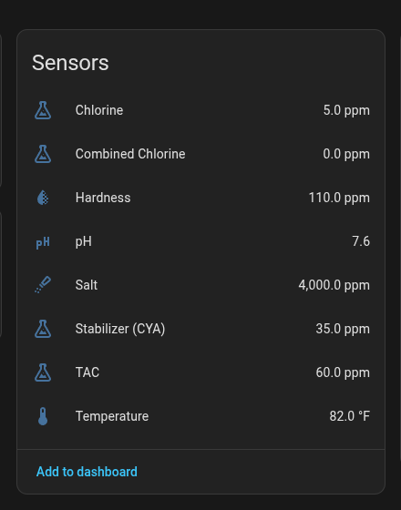

#### 5. The homepool card

A hand-written Lovelace card ships with the integration (no separate frontend install) — it mirrors the web app's water-status-board look: mono values, a status dot per parameter, an ideal/acceptable range gauge, and a "measured N days ago" readout, plus the six maintenance buttons and a "Log measurement" button that opens a popup form for logging a full measurement. The form adapts its fields to your installation's sanitizer (chlorine/bromine/salt), with a "more fields" toggle for hardness, CYA and notes.

Each parameter tile is interactive: **tap the tile** to open the log-measurement popup focused on that field, or **tap the 📈 icon** to open Home Assistant's native more-info dialog (history graph) for that sensor. Pressing a maintenance button flashes a "✓ Logged" confirmation.

<div align="center">

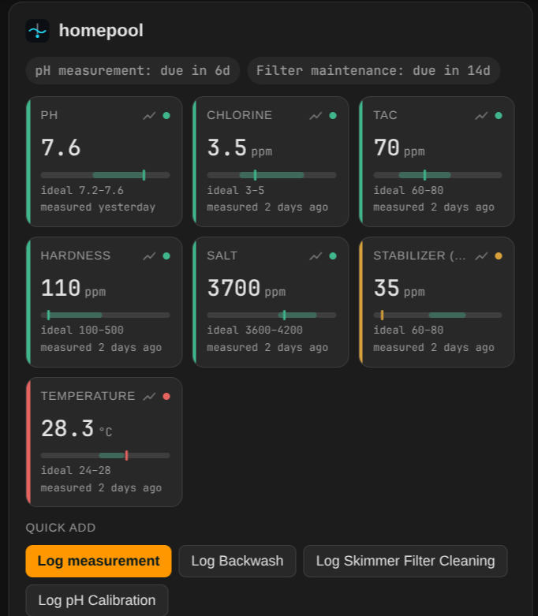

</div>

Add it from the card picker (search "homepool") or with YAML:

```yaml
type: custom:homepool-card
title: My pool
entity_prefix: sensor.my_pool
installation_id: 1
show_buttons: true
show_due: true
```

`entity_prefix` should match the prefix HA generated for your installation's sensors (e.g. `sensor.my_pool_ph` → prefix `sensor.my_pool`). `installation_id` is only needed if you want the "Log measurement" popup and tile-tap logging — find it in the homepool web app's URL or API. In the card's visual editor, you can skip typing either by hand: pick any one of your installation's sensors from the entity picker and both fields are derived from it automatically.

> If the card doesn't appear after installing/updating, hard-refresh your browser — the resource is cache-busted per release, but browsers occasionally hold onto a stale copy. As a manual fallback, add the resource yourself: Settings → Dashboards → ⋮ → Resources → Add Resource → URL `/homepool/homepool-card.js`, type JavaScript Module.

Prefer a more configurable, general-purpose pool widget instead? The [Pool Monitor Card](https://github.com/wilsto/pool-monitor-card) (installable via HACS as a frontend repository) also works against homepool's sensor entities.

> Dosage recommendations are web-app-only for now — the card doesn't surface them yet.

**History card.** A companion `homepool-history-card` renders a compact, read-only table of recent activity — measurements, treatments and maintenance — sourced from the `sensor.<prefix>_history` entity the integration exposes. Set `max_items` to cap the rows, and optionally filter with `types`:

<div align="center">

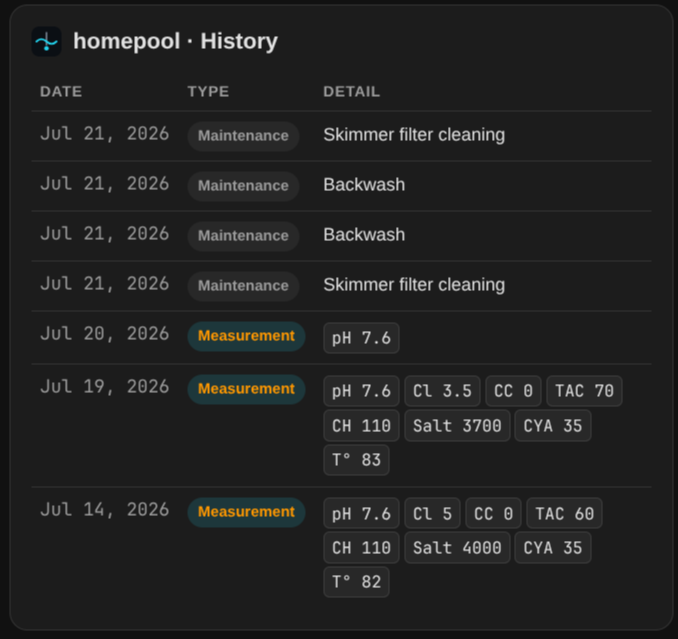

</div>

```yaml
type: custom:homepool-history-card
title: My pool
entity_prefix: sensor.my_pool
max_items: 20
types: [measurement, treatment, maintenance]
```

#### 6. The `homepool.log_measurement` service

For measurements (pH, chlorine, etc.), call the `homepool.log_measurement` service from a script, automation, or a dashboard button's `tap_action: perform-action`:

```yaml
type: button
tap_action:
  action: perform-action
  perform_action: homepool.log_measurement
  target: {}
  data:
    installation_id: 1
    ph: 7.2
    chlorine: 1.5
name: Log measurement
icon: mdi:flask-outline
```

---

### ⚙️ Configuration

Copy `.env.example` to `.env` and adjust the values:

| Variable | Description | Default |
|---|---|---|
| `POSTGRES_PASSWORD` | PostgreSQL password | — |
| `SESSION_SECRET` | Session secret key | — |
| `APP_BASE_URL` | Public app URL | `http://localhost:8090` |
| `ALLOWED_ORIGINS` | Allowed CORS origins | `http://localhost:8090` |
| `DEBUG` | Debug mode (logs reset links) | `false` |

> ⚠️ **Never commit your `.env` file**. It is already in `.gitignore`.

#### Customizing ideal water-parameter ranges

Every ideal/acceptable range shown in the app (pH, free chlorine, salt, CYA, alkalinity, hardness, temperature...) has sensible built-in defaults per installation type and sanitizer — including a salt water generator (SWG) profile with a higher CYA target (60-80 ppm), a matching free-chlorine band, and a lower total alkalinity target (60-80 ppm, vs. 80-180 ppm for manually-dosed pools) since SWG cells raise pH over time and a lower TA slows that rise — following [PoolMath](https://www.troublefreepool.com/blog/poolmath/) / Trouble Free Pool guidance. If your setup runs differently, open an installation's edit modal → **Water Chemistry Targets** tab to customize any band per installation, right from the UI — no env vars or restarts required.

---

### 🛠 Tech stack

| Layer | Technology |
|---|---|
| Frontend | React 19, Vite, Tailwind CSS |
| Backend | FastAPI, SQLModel, Python 3.13 |
| Database | PostgreSQL 16 |
| Auth | Cookie sessions (httpOnly, same_site=strict) |
| Deployment | Docker Compose |
| Typography | Sora + IBM Plex Mono |

---

### 📄 License

Distributed under the **MIT License**. See [LICENSE](LICENSE) for more information.

---

<div align="center">
  <sub>Made with ♥ · Self-hosted · Open source</sub>
</div>
